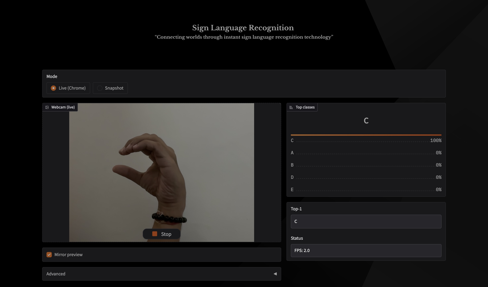

<!-- ~welcome note -->
<p align="center">
    
</p>

<div style="margin-top:12px;"></div> 

<!-- ~about this project -->
<h3 align="left"> ✨ About this project:</h3>

<div style="margin-top:12px;"></div> 

- Sign Language Recognition using CNN is a deep learning project that aims to bridge the communication gap between hearing-impaired individuals and others. It uses a Convolutional Neural Network (CNN) to recognize American Sign Language (ASL) hand gestures and predict the corresponding alphabet in real time.

- The system is trained on the ASL Alphabet Dataset, which contains over 87,000 labeled images across 29 classes (A–Z, SPACE, DELETE, NOTHING).
With high accuracy on training and validation, the model can recognize ASL gestures from static images and even from a live webcam feed using OpenCV.

- This project demonstrates how deep learning can be applied to assistive technology, making communication more inclusive and accessible.

<!-- ~dataset -->
<h3 align="left"> 📂 DataSet:</h3>

- The project uses the American Sign Language [ASL Alphabet Dataset from Kaggle](https://www.kaggle.com/datasets/grassknoted/asl-alphabet).

- Key Details:

  - Total Images: ~87,000  
  - Classes: 29 (A–Z alphabets + SPACE, DELETE, NOTHING)  
  - Image Size: Original 200×200 RGB, resized to 64×64 RGB for training efficiency  
  - Training/Validation Split:
    
    - Training set: ~70%  
    - Validation set: ~20%  

<!-- ~model -->
<h3 align="left"> 🧠 Model:</h3>

- The project uses a Custom Convolutional Neural Network (CNN) designed specifically for American Sign Language recognition.
  
    - Input Size: 64 × 64 × 3 (resized RGB images)
    - Output Classes: 29 (A–Z + SPACE, DELETE, NOTHING)
    - Optimizer: Adam
    - Loss Function: Categorical Crossentropy
    - Activation Functions: ReLU (hidden layers), Softmax (output layer)
    - Regularization: Dropout layers to prevent overfitting

- Training
  
    - Epochs: 15–25 (tuned)
    - Batch Size: 64
    - Callbacks: Early stopping & Model checkpointing
    - Data Augmentation: Rotation, zoom, horizontal flip, shear
    - The final trained model is saved as SLR_final.h5.

⚠️ The model file is too large for GitHub (>100 MB).  
👉 Download it here: [Google Drive Link](https://drive.google.com/drive/folders/1rzfvnuyjBEmngFbhcIPVcTDhJ1RDGN7A?usp=drive_link)

<!-- ~result -->
<h3 align="left"> 📊 Results:</h3>

- The custom CNN model was trained on the ASL Alphabet Dataset and achieved high accuracy across training, validation, and testing.

- Model Performance
  
    - Training Accuracy: 98.86%
    - Validation Accuracy: 95.89%
    - Test Accuracy (with data augmentation): 95.29%
  
- These results indicate that the model generalizes well and avoids significant overfitting.

- Confusion Matrix:
  
    - The confusion matrix illustrates how well the model distinguishes between different ASL signs:

 

- Sample Predictions

    - Here are some example outputs from the trained model:

        | Sign | Prediction |
        |------|------------|
        |  | **C** |
        |  | **D** |

<!-- ~installation & usage -->
<h3 align="left"> ⚙️ Installation & Usage:</h3>

1. Clone the Repository
```bash
git clone https://github.com/hxrdikk/Sign-Language-Recognition.git
cd Sign-Language-Recognition
```

2. Install Dependencies
```bash
pip install -r requirements.txt
```

3. Download Pretrained Model
The trained model (SLR_final.h5) is too large for GitHub.  
👉 Download `SLR_final.h5` from [Google Drive](https://drive.google.com/drive/folders/1rzfvnuyjBEmngFbhcIPVcTDhJ1RDGN7A?usp=drive_link) and place it in the project root.

4. Run Notebook
```bash
jupyter notebook SignLanguageRecognition.ipynb
```

5. Live Prediction via Webcam
```bash
python model_load.py
```

<!-- ~deployment -->
<h3 align="left"> 🚀 Deployment:</h3>

~ Sign Language Recognition (ASL) is currently deployed on Hugging Face → [Live on Hugging Face Spaces](https://huggingface.co/spaces/hxrdikkk/sign-language-recognition)

- Deploy your own instance:
  
    - Push your code to GitHub
    - Go to Hugging Face Spaces and create a new Gradio Space 
    - Select your repo and connect it to the Space
    - Deploy 

<!-- ~project structure -->
<h3 align="left"> 🏗 Project Structure:</h3>

```
Sign-Language-Recognition/
├── Results/                       # Folder containing result images (predictions & confusion matrix)
│   ├── C.png
│   ├── D.png
│   └── Confusion Matrix.png
│
├── app.py                         # (Optional) Gradio app for interactive UI
├── background.jpg                 # Background image (used in app.py / UI)
├── banner.png                     # Banner image (used in README or app UI)
├── model_load.py                  # Script for loading model & real-time webcam predictions
├── test_Data_Split.py             # Utility script for dataset splitting
├── requirements.txt               # Dependencies with pinned versions
├── SignLanguageRecognition.ipynb  # Jupyter notebook for training & evaluation
├── LICENSE                        # Open-source license (MIT)
├── README.md                      # Project documentation
└── .gitignore                     # Git ignore rules (venv, dataset, etc.)

```

<!-- ~features -->
<h3 align="left"> 🏆 Features:</h3>

- ASL alphabet recognition (A–Z + SPACE, DELETE, NOTHING)  
- Custom CNN architecture  
- Confusion matrix + classification report  
- Real-time webcam prediction with OpenCV  
- Dataset splitting script (`test_Data_Split.py`)  

<!-- ~author -->
<h3 align="left"> 👨‍💻 Author:</h3>

- Hardik Jain

<!-- ~license -->
<h3 align="left"> 📜 License:</h3>

- This project is open-source and available under the [MIT License](LICENSE).
